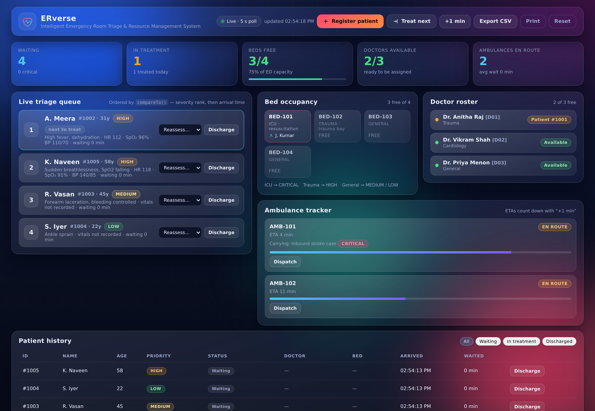

# ERverse — Intelligent Emergency Room Triage and Resource Management System

Console-based **Java** application with a **Node.js/Express REST API** and a **glassmorphism web
dashboard**, built for **CS5304 – Java Programming, Project-Based Learning (PBL)**.

> Treatment order is decided by `java.util.PriorityQueue` (a binary min-heap) through
> `Patient.compareTo()`, not by arrival order. Severity **CRITICAL → HIGH → MEDIUM → LOW** wins;
> arrival time only breaks ties inside the same band.

---

## 1. Project status

| Layer | Files | Status |
|---|---|---|
| Java core (triage engine, resources, exceptions, JDBC/SQLite) | `src/erverse/*.java` (13) | ✅ complete |
| JUnit 5 test suite (TC-01…TC-04 + concurrency + persistence) | `test/erverse/*.java` (5 classes, 27 tests) | ✅ 27/27 passing |
| Express REST API (mirror of the Java ordering rule) | `server/app.js` | ✅ complete, 31/31 REST checks passing |
| Glassmorphism web dashboard | `public/index.html`, `styles.css`, `app.js` | ✅ complete, screenshot in `docs/` |
| Deviation log vs. the submitted PBL report | `CHANGELOG.md` | ✅ |
| Verification evidence (report Tables 6.1 / 6.2 / 7.1) | `docs/VERIFICATION.md` | ✅ |

The repository is at **100 % of the scope promised in Chapters 4 and 5 of the report**, with five
defects in the report's own code snippets and test matrix corrected — every one of them is listed in
[`CHANGELOG.md`](CHANGELOG.md).

---

## 2. Repository layout

```
ERverse/
├── src/erverse/
│   ├── Priority.java                    enum CRITICAL/HIGH/MEDIUM/LOW (rank 1-4) + fromString()
│   ├── Patient.java                     Comparable<Patient>; vitals; audit trail
│   ├── Doctor.java                      doctorId, name, specialization, availability
│   ├── Bed.java                         bedId + BedType (ICU / TRAUMA / GENERAL)
│   ├── Ambulance.java                   status, ETA countdown, pre-arrival patient on board
│   ├── TriageException.java             base checked exception
│   ├── NoDoctorsAvailableException.java
│   ├── NoBedsAvailableException.java
│   ├── InvalidPatientDataException.java
│   ├── TriageSystem.java                synchronized PriorityQueue engine + resource allocation
│   ├── DatabaseManager.java             JDBC/SQLite schema, PreparedStatement persistence
│   └── Main.java                        console menu (13 actions)
├── test/erverse/
│   ├── TriageOrderingTest.java           TC-01 + heap invariants (500-patient surge)
│   ├── ResourceAllocationTest.java       TC-02 + exhaustion behaviour
│   ├── DischargeAndReassessmentTest.java TC-03 + reassessment + vitals escalation
│   ├── ReportExportTest.java             TC-04 + CSV escaping
│   ├── ConcurrencyTest.java              Week-4 race condition regression (2000 registrations)
│   └── PersistenceTest.java              JDBC/SQLite round-trip + injection safety
├── server/app.js                         Express REST API on :3000, state in data/erverse_data.json
├── public/                               dashboard (HTML5 + vanilla CSS + JS, no external CDN)
├── scripts/                              fetch-deps.sh, run-tests.sh, run-demo.sh, smoke-test.js
├── docs/                                 dashboard screenshots + VERIFICATION.md
├── lib/                                  sqlite-jdbc + junit jars (downloaded, not committed)
└── package.json
```

---

## 3. Quick start

### Requirements
* **JDK 17 or newer** (`javac --release 17` is used)
* **Node.js 18 or newer** (for the REST API and dashboard only)

### One command (demo)

```bash
./scripts/fetch-deps.sh     # downloads lib/sqlite-jdbc-*.jar and lib/junit-*.jar
./scripts/run-demo.sh       # compiles the Java core, starts the API + dashboard on :3000
```

Then open **http://localhost:3000**.

### Console application

```bash
javac -d bin src/erverse/*.java
java -cp "bin:lib/sqlite-jdbc-3.46.1.3.jar" erverse.Main      # Windows: "bin;lib\\sqlite-jdbc-...jar"
```

Menu 13 loads a five-patient demo surge (one CRITICAL, one patient auto-escalated on vitals) — the
quickest way to show the heap reordering during a viva. Every registration, treatment, reassessment
and discharge is written to `data/erverse.db`, and the queue is rebuilt from that file on the next
start.

> The SQLite driver is **optional at run time**: without it the console prints one warning and runs
> in memory only, so the Java engine can always be demonstrated even on a machine with no jars.

### Web layer

```bash
npm install
npm start                       # http://localhost:3000
node scripts/smoke-test.js      # 31 REST checks against the running server
```

### Tests

```bash
./scripts/run-tests.sh          # compiles + runs the 27 JUnit tests
```

---

## 4. What the system does

**Java core**

* **Severity triage** — `PriorityQueue<Patient>`, `O(log n)` enqueue/dequeue, `O(1)` `peek()` of the
  next patient. Ordering defined once in `Patient.compareTo()` (rank → arrival → patient id).
* **Resource allocation** — `treatNextPatient()` peeks the heap root, secures a doctor and a bed,
  and only then dequeues. Specialisation-aware doctor choice, acuity-aware bed choice
  (ICU → CRITICAL, trauma → HIGH, general → MEDIUM/LOW).
* **Exceptions** — `NoDoctorsAvailableException`, `NoBedsAvailableException`,
  `InvalidPatientDataException` (all checked, all subclassing `TriageException`). A failed dispatch
  never loses a patient.
* **Thread safety** — `registerPatient`, `treatNextPatient`, `dischargePatient`, `reassessPatient`
  and the query methods are `synchronized`; patient ids come from an `AtomicInteger`.
* **Persistence** — `DatabaseManager` creates the SQLite schema (`patients`, `doctors`, `beds`,
  `ambulances`, `triage_events`), writes every change through `PreparedStatement`s, and reloads the
  session at start-up.
* **Clinical override** — staff can reassess any waiting patient's band (re-heapifies the queue), and
  an opt-in **vitals escalation sweep** promotes a waiting patient whose SpO₂ drops below 92 % or
  whose heart rate leaves the safe band.
* **Reporting** — text daily report (menu 10) and CSV export (menu 11 → `data/ERverse_Daily_Report.csv`).

**REST API** (Table 5.2 of the report)

| Method | Endpoint | Purpose |
|---|---|---|
| `GET` | `/api/health` | liveness probe |
| `GET` | `/api/dashboard` | metric cards, live queue, beds, doctors, ambulances, events — polled every 5 s |
| `POST` | `/api/patients` | register a patient (validates identically to the Java side) |
| `POST` | `/api/patients/treat-next` | dispatch the heap root |
| `POST` | `/api/patients/:id/discharge` | discharge + release doctor and bed |
| `POST` | `/api/patients/:id/reassess` | change a waiting patient's band |
| `POST` | `/api/vitals-sweep` | run the vitals escalation sweep |
| `POST` | `/api/ambulances/tick` | advance the ETA simulation one minute |
| `POST` | `/api/ambulances/:id/dispatch` | dispatch a unit with an ETA |
| `POST` | `/api/ambulances/:id/pre-arrival` | log a patient inbound (pre-arrival planning) |
| `GET` | `/api/report.csv` | **TC-04** — `ERverse_Daily_Report.csv` download |
| `POST` | `/api/reset`, `/api/demo-surge` | demonstration helpers |

Errors use the same vocabulary as the Java exception hierarchy, mapped onto HTTP status codes:
`400 INVALID_PATIENT_DATA`, `409 NO_DOCTORS_AVAILABLE`, `409 NO_BEDS_AVAILABLE`,
`409 ALREADY_DISCHARGED`, `404 PATIENT_NOT_FOUND`.

**Dashboard** — five live metric cards, the priority-queue stream that visibly re-orders as patients
arrive, a bed-occupancy grid coloured by acuity, the doctor roster, an ambulance tracker with
countdown ETAs, patient history with filters, the audit trail, a registration modal (with the
severity bands of the report's Figure 5.1), CSV/print export, and a "Treat next" action. It polls
every five seconds and additionally refreshes immediately after any staff action, so the 5 s lag
noted in the Week 9 review is not felt in practice.



---

## 5. Build & run reference

| Task | Command |
|---|---|
| Download Java jars | `./scripts/fetch-deps.sh` |
| Compile Java core | `javac --release 17 -d bin src/erverse/*.java` |
| Run console app | `java -cp "bin:lib/sqlite-jdbc-3.46.1.3.jar" erverse.Main` |
| Run JUnit suite | `./scripts/run-tests.sh` |
| Start API + dashboard | `npm start` (or `node server/app.js`) |
| REST smoke test | `node scripts/smoke-test.js` |
| Reset state | delete `data/` (Java and Node state are separate files) |

---

## 6. Documentation

* [`CHANGELOG.md`](CHANGELOG.md) — every deviation from the submitted report, with the reason and the
  fix (read this before the viva).
* [`docs/VERIFICATION.md`](docs/VERIFICATION.md) — evidence for Tables 6.1, 6.2 and 7.1: complexity
  analysis, the functional test matrix, the console transcript, the restart proof and the screenshots.
* `docs/dashboard.png`, `docs/dashboard-full.png` — Figures 5.1 / 7.1 for the report.

---

## 7. Ethics and scope

ERverse processes sample data only. The severity bands are assigned by trained staff: the queue is
**decision support, not decision making**, which is why reassessment and vitals escalation are
explicit, logged overrides rather than hidden automation. A production deployment would additionally
need role-based access control, encryption at rest and in transit, retention policy enforcement and
an audit trail on the database itself (report §8.4). Billing/payment integration and pharmacy
inventory remain out of scope by design (report §1.4).

## 8. Team

| Member | Roll number | Responsibility |
|---|---|---|
| S R Hariharan | 2104251040818 | Java core — `Priority`, `Patient`, `TriageSystem`, exception hierarchy, `DatabaseManager` |
| AGHILAN M | 2104251040043 | Express REST mirror and glassmorphism dashboard; Java/JS comparator parity |

Supervisor: **Mr. R. Rahul, M.Tech**, Department of Computer Science and Engineering,
Chennai Institute of Technology.
